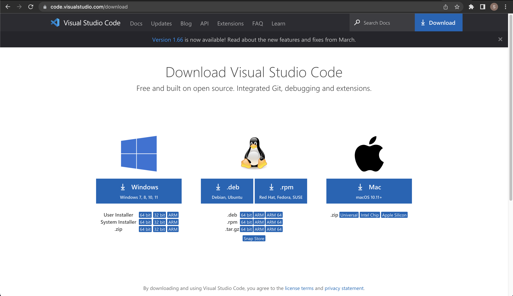
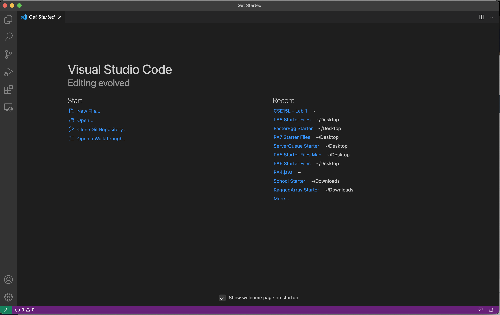
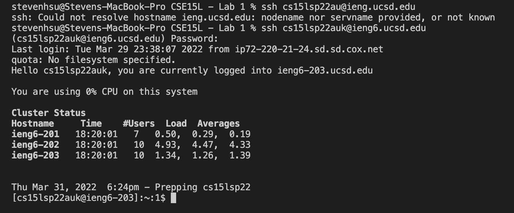
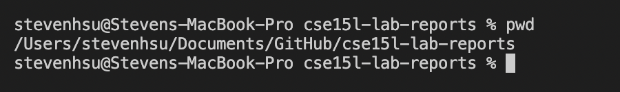
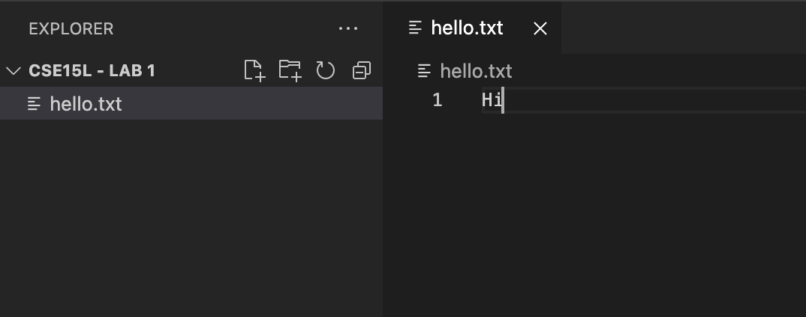
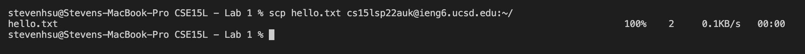
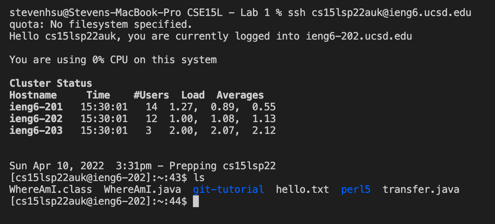
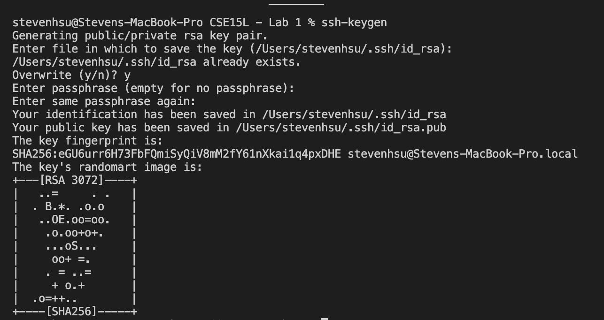
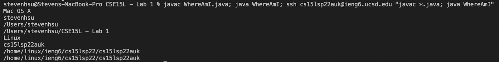

## Lab Report 1

> Hello incoming 15L students. Here I will document the steps to connect to a remote computer

---
**Step 1**

Install [VS Code](https://code.visualstudio.com/download) first.
It will take you to a screen like below:


Select your operating system and ***download***

---
**Step 2**

You are going to see a window like this when you finish installing



Now to access a remote desktop, we are going to have to install SSH. The icon on the **left** with 4 squares is the extensions tab. Search **SSH** and install "Remote - SSH" by Microsoft.

Next, click the **top left** with the file icons - this is your file explorer. You can open a folder and create a new folder called:

> remoteDesktopTest

Here we are working in a new project and so to connect to a remote desktop, we need the terminal. You can access it 2 ways:

1. Press `Ctrl+Shift+P` on Windows or `Command+Shift+P` on Mac. Then type: ***view toggle terminal*** next to the carrot sign.
2. Line up your cursor on the bottom blue line. Place your cursor on top and drag up.

Once the terminal is open and SSH is installed, run the command:

```$ ssh cs15lsp22zz@ieng6.ucsd.edu```

"zz" is the special identifier for different students so be sure to reset your password as you will need to know it to access the remote desktop.

When we run the command, it should prompt for a password. Don't worry that you can't see it, that's for security purposes. Once typed, it should look like:



You've successfully connected to a remote desktop now!

---

**Step 3**

You can also use different UNIX commands in the terminal in VS Code. Here's one example:



Try some other commands in the terminal. Here are a list of useful commands for you to try:

* `cd ~`

> Changes to the root directory

* `cd`

> change to directory of your choice

* `ls -lat`

> This lists all files even if hidden in long format(ls -a, ls -l, ls -t combined)

* `ls -a`

> This lists all files even if hideen

* `ls [directory]` | ie /home/(username)/downloads/

> This lists all files(not hidden) in your downloads folder

* `cp /home/linux/ieng6/cs15lsp22/public/hello.txt ~/`

> Copies "hello.txt" to the root directory of local reposiory

* `cat /home/linux/ieng6/cs15lsp22/public/hello.txt`

> Creates new empty file called "hello.txt" in remote desktop

---

**STEP 4**

Let's try to move files with SCP. First let's create a file called "hello.txt" and you can add whatever text you want. 



Then we can copy this file over to a remote machine by using the command:

```scp hello.txt cs15lsp22zz@ieng6.ucsd.edu:~/```

Change zz to your username and it should print something like this:



Now we need to check that it has been uploaded so log back into the remote computer using **Step 2** and once you have entered your password, type the command `ls`. You should see your "hello.txt" file in the home directory.



---

**Step 5**

Typing the password over and over again is tiring so using `ssh-keygen` will make sure you don't have to type it again. This is safe because it creates a local file on your computer and the remote computer and compares it - taking the place of a password.

1. Type `ssh-keygen` on our own directory. Make sure you are not accessing the remote computer's directory.
2. It will prompt to save a file. Just press `enter`. (Remember the file path, we will use it later)
3. It will ask for a paraphrase. Do not add one. just press `enter`.
4. It will ask for the same paraphrase. We didn't add one, so press `enter`.

Now it will generate our "key" in a local repository and it should look something like this when you are done:



Log back into the remote desktop using **Step 2**. Now that we are on the server, type the command:

`mkdir .ssh`

Now log out of the remote computer by pressing `Ctrl + D`

On the client side, type the command:
```
scp /Users/(user-name)/.ssh/id_rsa.pub
cs15lsp22zz@ieng6.ucsd.edu:~/.ssh/authorized_keys
```

Delete (username) and type in the name of the home directory. This was shown when it prompted to save the key on our local machine. Use that username and remember to replace zz with your school assigned username.

After this you should try to use ssh again and you won't have to type in your password.

---

**Step 6**

We can make using the terminal easier. For example, if we wanted to compile a java file, we need to use `javac (filename).java` and then `java (filename)`. That's two steps to run a basic java command. We can reduce this by using the **semicolon** so that we can use multiple commands.

With this idea in mind, we can shorten the process to compile a file in the client directory and then in the remote directory. An example file of WhereAmI.java tells the directory it's in and the username.

We can use the command:
```
javac WhereAmI.java; java WhereAmI; ssh cs15lsp22auk@ieng6.ucsd.edu "javac WhereAmI.java; java WhereAmI"
```



The quotations are for after the ssh command. You should try different combinations as well and play around with improving workflow inside of the terminal.

***Hope you enjoyed!***

Best, Steven