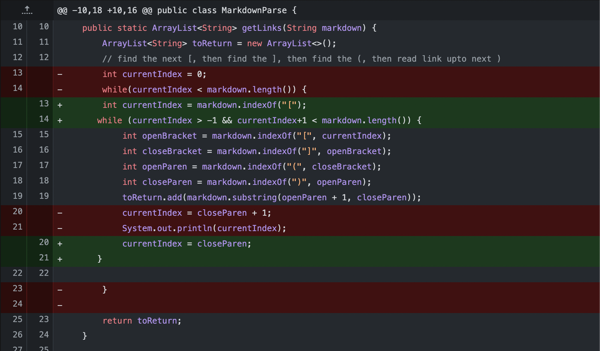
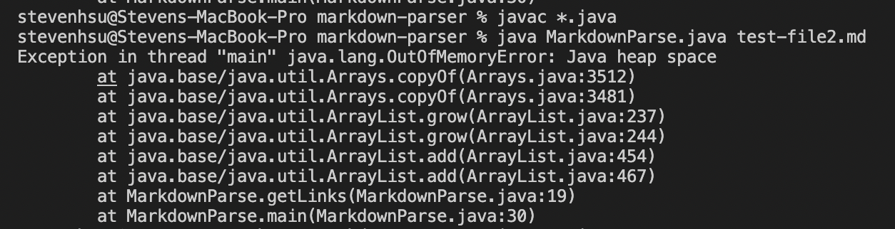
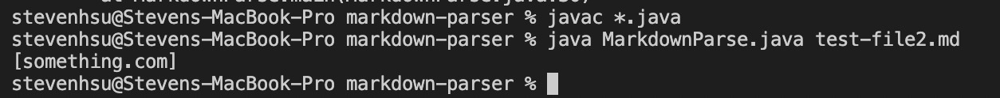
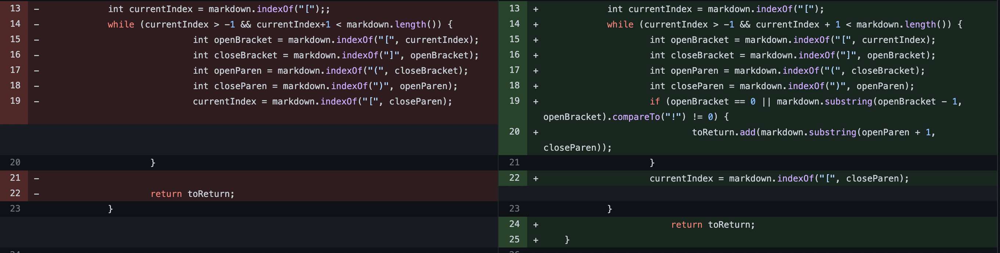
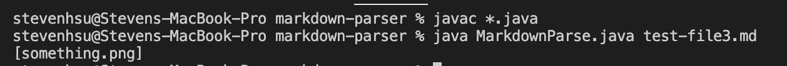
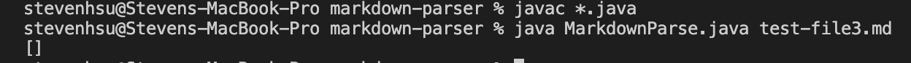
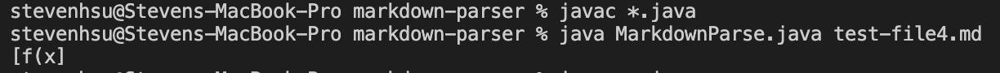
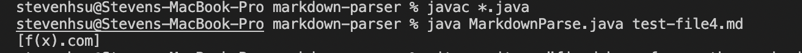

## Lab Report 2

---

**Code Change 1:**

Here is the picture of the code difference to fix the bug of text after the link making the code produce a symptom of an infinite loop.

Here is the link to the test file that prompted us to make the change.

[Test File One](https://github.com/Steven-Hsu1/markdown-parser/blob/main/test2.md)

With the original code that we forked, it would give an infinite loop which would cause an out of memory error. 

With the changes we implemented, it was able to fix the bug and print out the correct result.

The bug occured because the original code set `currentIndex = closeParen + 1` but if there was text after this then the while loop never ends because the markdown length is still greater because of those extra characters from the words. This created the infinite loop we saw in the bug, but the fix was to change the while loop conditions so that it accounted for text before and after the link statement.

---

**Code Change 2**

Here is the picture of the code difference to fix the bug of reporting images as links creating a symptom for an unexpected output.

Here is the link to the test file that prompted us to make the change.

[Test File Two](https://github.com/Steven-Hsu1/markdown-parser/blob/main/test-file3.md)

With the original code, it would give us whatever was inbetween the parentheses, even if it wasn't a link. 

We want the parser to only check for links so if it is an image, it should skip it so here's the output running the fixed code.

This bug is caused from the fact that the original code doesn't really check if what is in between parentheses are actually links or not. It basically just takes the substring in between parenthese no matter what so to fix this, we add and if statement so that if index of an exclamation mark is directly behind an open bracket, then we know it is an image so we don't add anything to return while keeping the functionality of reading multiple links.

---

**Code Change 3**

Here is the picture of the code difference to fix the bug of parentheses inside links causing the parser to have a symptom of an unexpected output.

Here is the link of the test file that prompted us to change the code.

[Test File Three](https://github.com/Steven-Hsu1/markdown-parser/blob/main/test-file4.md)

With the original code, it would produce an unexpected result when there were parentheses within the result.

With the fixed code, it would print the desired result, but note this is not a complete fix.

This is not a complete fix. I couldn't get it to work for all cases because what if there is a case where you have a link and then parentheses after the link. Then the open parentheses are included and there's no way to differentiate it. I was think about having the closeParen less than the next open bracket, but that would only solve the issue for multiple links without solving the idea of a buffer zone of parentheses inbetween two links. This fix is essentially getting the last closeParen in the file so it'll return the entire link if the parentheses are embedded inside the link. 

___

Thanks,

Steven