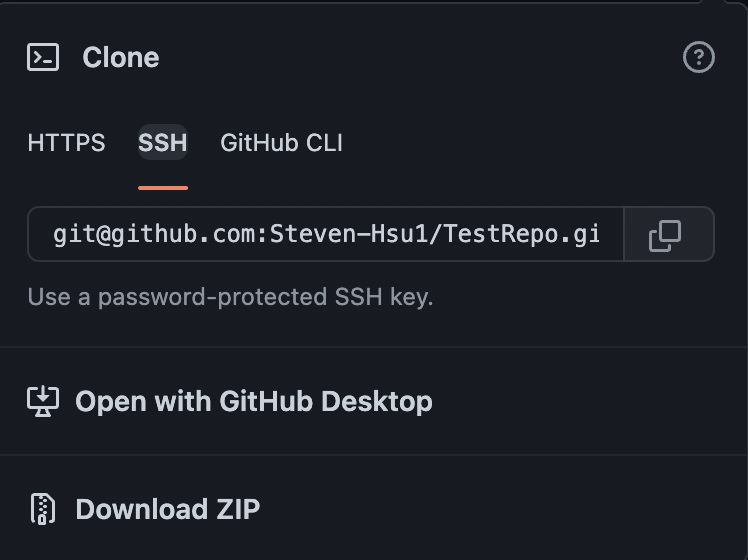

## Lab Report 3

---

**Part 1:**

So first we have to create the config file for ssh so we use the command `cd ~/.ssh/` then we use `touch config` to create the config file within the ssh directory.

Then, we use `vim config` to edit the config file and we paste in the necessary info. Here is what this looks like:


We press `Esc` followed by `Enter` and `:wq` to save all our edits once we are done.

Now let's try to log into ssh. Instead of typing out the long username part, all we need is `ssh ieng6` which then uses the config file to get the info of our account. Here is a screenshot of what I typed:


Now let's try to copy a file from our local repository onto the remote repository using scp. Usually, we would have to type `scp [filename] cs15lsp22zz@ieng6.ucsd.edu:~/` as the command, but we can use the alias - `ieng6` so we don't have to type all that down. Here is what it will look like with a test file:


---

**Part 2**

Here is the ssh key on github:


Here is a look at the files within `~/.ssh/` where the public key for the github ssh is stored as well as the private key.


The `id_rsa_github.pub` is where the public ssh key is stored in and `id_rsa_github` is where the private key is stored on my local machine.

Now to commit/push changes from our remote repository, we need to enter the following line:


The stuff after `git remote set-url origin` is copied from a test repo I made. This link is different from an actual link. Rather it is an ssh connection to that repo, so you need to click on ssh and then copy.



Then after we've established that link, we can use the normal commands of 
- `git add --all`
- `git commit -m ""`
- `git push`


Here is the link to the test repository:

[TestRepo](https://github.com/Steven-Hsu1/TestRepo/tree/main)

---

**Part 3**

For copying an entire directory, we can use the command `scp -r . ieng6:~/markdown-parse` as shown below:


Then to check that it has copied, we can again use `ssh ieng6` to log into our remote account. Here is the `ls` of the directory we copied. 


Then we can run this on the remote server using the junit versions of `javac` and `java` respectively.


We can also use a singular command to both copy a directory and run it. Let's try it with markdown-parse. I'm going to use the command `rm -r . markdown-parse` to delete the entire directory off the remote computer so we can use a singular command to copy and run the tests. Here is the command:

```scp -r . ieng6:~/markdown-parse; ssh ieng6 "cd ~/markdown-parse; javac -cp .:lib/junit-4.13.2.jar:lib/hamcrest-core-1.3.jar MarkdownParseTest.java; java -cp .:lib/junit-4.13.2.jar:lib/hamcrest-core-1.3.jar org.junit.runner.JUnitCore MarkdownParseTest"```

Here is the run:


---

***Hopefully this helped - Steven***


