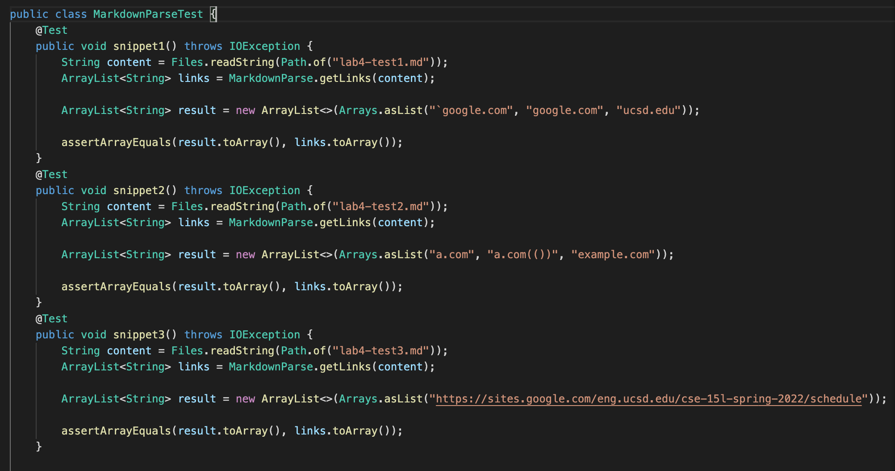
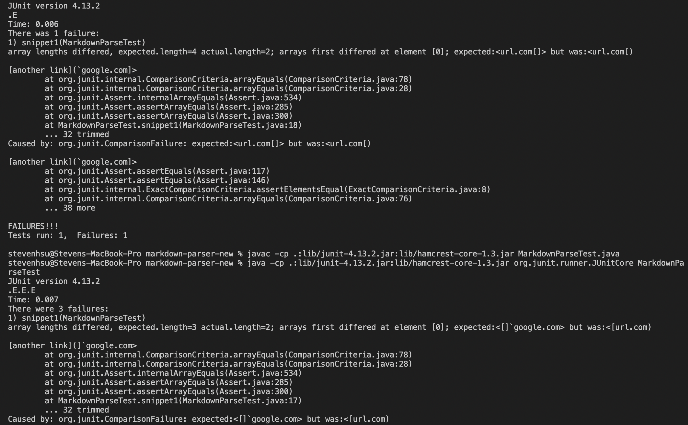
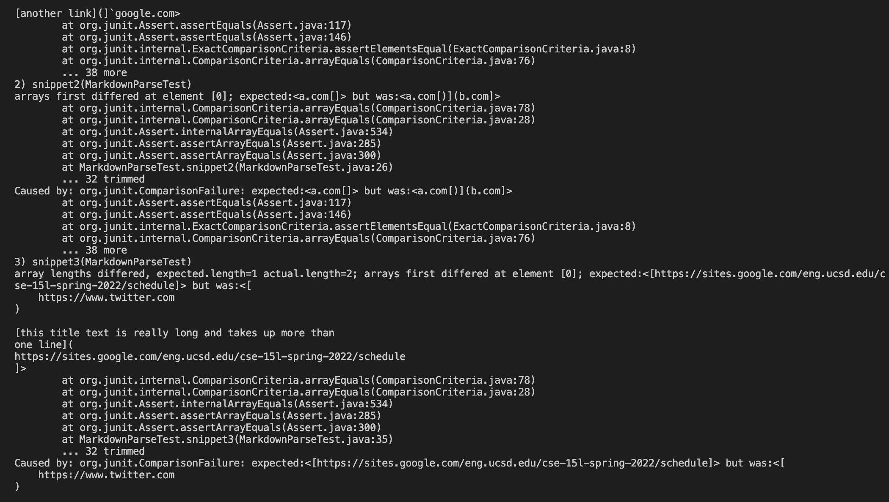
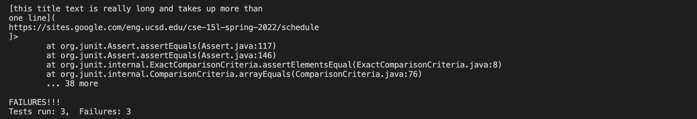
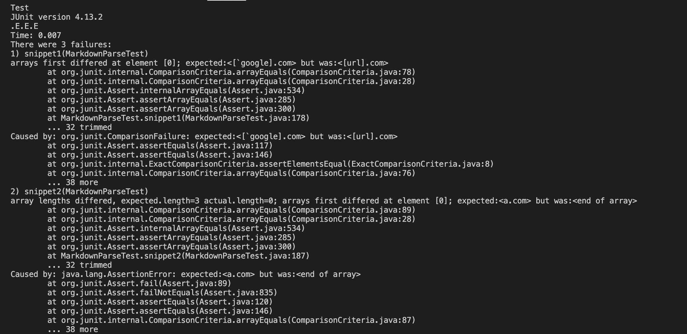
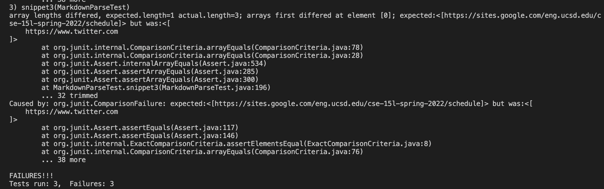

# Lab Report 4

---

Here is the link to my respository:
[My Repository](https://github.com/Steven-Hsu1/markdown-parser)

Here is the link to the reviewed repository: 
[Other Repository](https://github.com/kcyy127/markdown-parser)

--- 
The expected outputs for the snippets are:

```json
snippet 1: ["`google.com", "google.com", "ucsd.edu"]

snippet 2
["a.com", "a.com(())", "example.com"]

snippet 3
["https://sites.google.com/eng.ucsd.edu/cse-15l-spring-2022/schedule"]
```

--- 

Here is the code for JUnit:



--- 

All 3 tests failed for my implementation of markdownParse:







---

All 3 tests also failed for the implentation we reviewed:





---

**Questions**

**Snippet 1:** I don't think there is a code change less than 10 lines that we could do to make the code work with backticks. Backticks are used to denote code and should basically be ignored, but if we check if there is a backtick and go until the next backtick, I don't think there is an easy implementation to let the getLinks method understand that it should ignore these lines of code. Maybe we could somehow do a check of the indices and have the indexOf method ignore these indices, but I feel this is a pretty involved change with more than 10 lines.

**Snippet 2:** I think there is a code change less than 10 lines that we could do to make the code work with nested brackets, parentheses, and escaped characters. I think we could add a check where it checks before the next link(starts with "[") and so would get the last index of the other characters `"]", "(", ")"` which would work with these nested structures.

**Snippet 3:** I think there is a code change less than 10 lines that we could do to make the code work with line breaks. We could have a check in the while loop at the top if there is line break before the entire amount of checks are completed. Then if there is a line break, then redo the checks from the start. This would be less than 10 lines of code.

