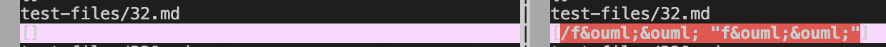
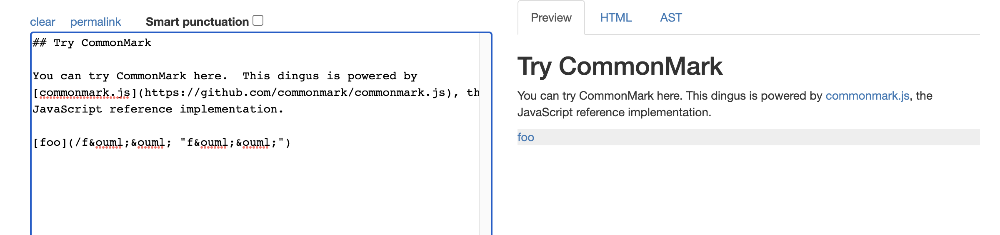
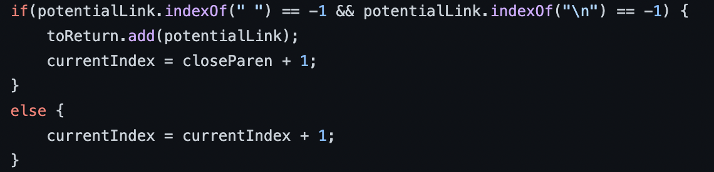
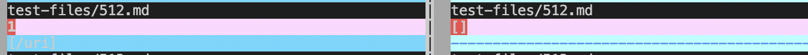
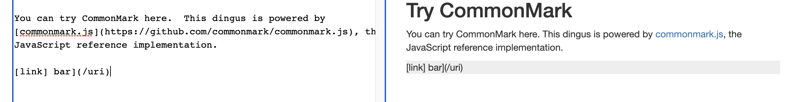
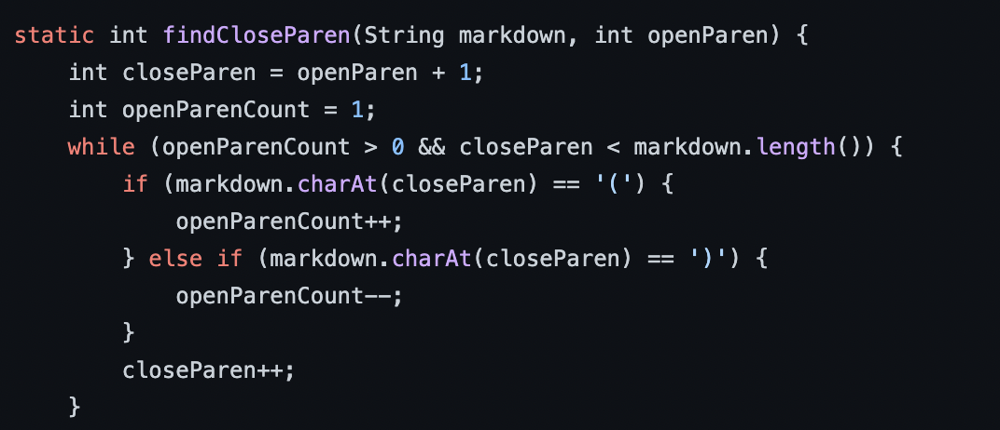

# Lab Report 5

---

***First test file***

Here is the link to the first test file I will be looking at:
[file1](https://raw.githubusercontent.com/nidhidhamnani/markdown-parser/main/test-files/32.md)

I found this differing result using vimdiff through output redirection of the bash script.

Here is the image of vimdiff: 

> ***Note***: Given implementation is on the left, my implementation is on the right

We can see there is a differing result. Going to CommonMarkDemo website and plugging in the test from 32.md, we get:

This demonstrates that this is indeed a link so my implementation is correct.

Here is where I think the error occurs in the given implementation:

We see the if statement and potential link is the subtring between two parentheses. It checks that there are no spaces since the index is -1. However, in 32.md we see that there is a space in the link, but it is a valid link type. This can be fixed by just removing this condition.

---

***Second test file***

Here is the link to the second file:
[file2](https://github.com/nidhidhamnani/markdown-parser/blob/main/test-files/512.md)

I found this differing result using vimdiff through output redirection of the bash script.

Here is the image of vimdiff: 

> ***Note***: Given implementation is on the left, my implementation is on the right

We can see there is a differing result. Going to CommonMarkDemo website and plugging in the test from 512.md, we get:

This demonstrates that this is *not* a link so we should get an empty array as our output. This shows that my implementation is correct from the vimdiff image.

Here is where I think the error occurs in the given implementation:

We see that this implementation only searches if there are extra parentheses within the link. It fails to consider the idea that there might be nested brackets, so an easy fix would just be to create a separate function for checking duplicate brackets as well. This would be very similar to the function we see in the image.

